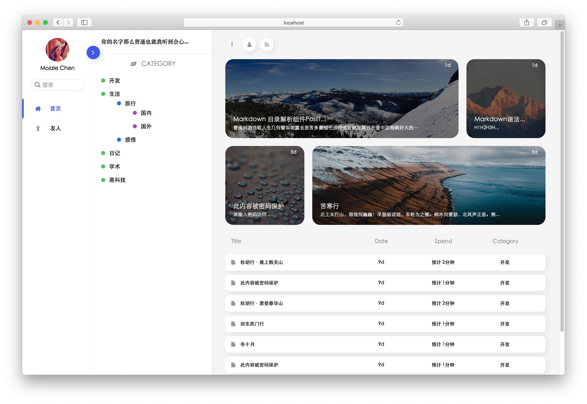

# Moz v1.0

> 无与伦比的追求冰冷的敲打着我的灵魂

[Preview](https://www.npmrundev.com) | [文档](https://www.npmrundev.com/index.php/archives/4)

## 起步

离开一线搬砖的生活半年(19.04 月离职),冲动之下,花费了一周左右时间做出了这个主题`Moz`,名字源自`White Collar(妙贼警探)`里`Neal Caffrey`的好友`Mozzie`

使用了`less`完全重构了样式,除去`CDN`依赖库,静态资源在`50kb`以内,如果开启了`http2.0`以及`gzip`,那还不起飞咯!

## 功能

- 全站无插件,极其容易配置
- Pjax
- 代码高亮,内置`github`风格
- 响应式
- 三栏式设计,高效专注

## 使用

请移步[文档](https://www.npmrundev.com/index.php/archives/4),那是最新的
